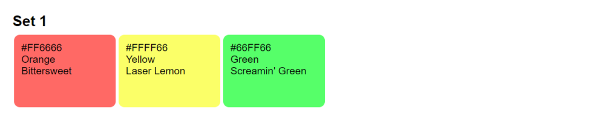

# Colorly - Command Line Color Palette Generator

[](https://badge.fury.io/rb/colorly)
[](https://github.com/DannyBen/colorly/actions?query=workflow%3ATest)
[](https://codeclimate.com/github/DannyBen/colorly/maintainability)

---

Colorly is a command line urility and a Ruby library for generating color
palettes using a simple DSL.

It is a thin wrapper around the [chroma] gem.

The colorly command line outputs the palette as JSON, YAML or HTML.

---

## Install

```
$ gem install colorly
```

## Example

Colorly provides you with a simple ruby-based DSL for generating a color palette.

Start by creating this file:

```ruby
# sample.rb
title "Set 1"
add 'red'.lighten 20
add last.spin 60
add last.spin 60
```

then run it by calling:

```
$ colorly sample.rb output.html
```

output:



For more detailed examples, view the [examples folder](examples).


## Usage 

Colorly scripts are built with a minimalist set of Ruby commands (DSL):

```ruby
# Start a new color set
title "Any unique name for this set"

# Add colors to this set
add 'yellow'.darken(10).desaturate(10)
add last.spin 20

# Start another set
title "New set"
add '#ff3344'
# ...
```

The colors provided to the `add` command can be
[anything that is supported by `Chroma`](https://github.com/jfairbank/chroma#creating-colors),
or an array of the same.

In addition, you can call the below `Chroma` methods directly on any color.
They will be forwarded to `Chroma`:

```ruby
'red'.spin        # same as 'red'.paint.spin
'red'.brighten    # same as 'red'.paint.brighten
'red'.darken      # same as 'red'.paint.darken 
'red'.lighten     # same as 'red'.paint.lighten 
'red'.saturate    # same as 'red'.paint.saturate 
'red'.desaturate  # same as 'red'.paint.desaturate 
'red'.greyscale   # same as 'red'.paint.greyscale (also grayscale)
'red'.palette     # same as 'red'.paint.palette
```

You can use the last added color with the variable `last`, and generate a
random color by calling `random`:

```ruby
title "Example"
add 'red'.spin 10
add last.spin 30
add last.spin 30
add random.desaturate 10
```

## Contributing / Support

If you experience any issue, have a question or a suggestion, or if you wish
to contribute, feel free to [open an issue][issues].

## Credits

- [Jeremy Fairbank](https://github.com/jfairbank) for the [chroma] gem.
- [Chirag Mehta](https://chir.ag/) for the original Javascript [color naming functions](https://chir.ag/projects/name-that-color).
- [Colblindor](https://www.color-blindness.com/color-name-hue/) for the additional base color (shade) work.


---

[chroma]: https://github.com/jfairbank/chroma
[issues]: https://github.com/DannyBen/colorly/issues